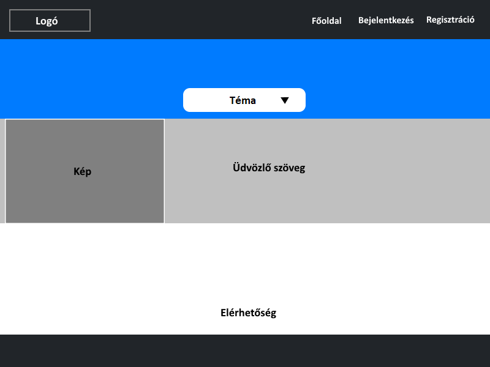
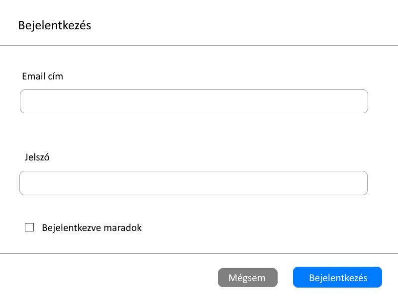
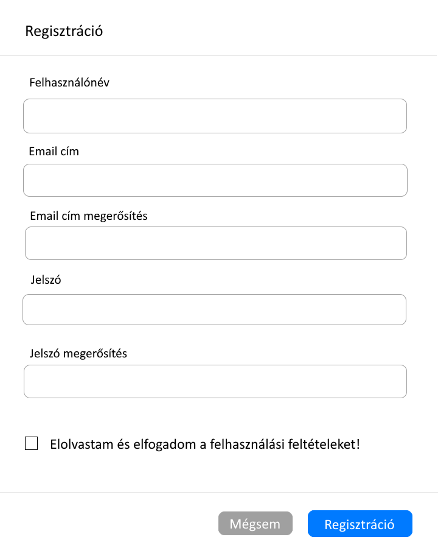
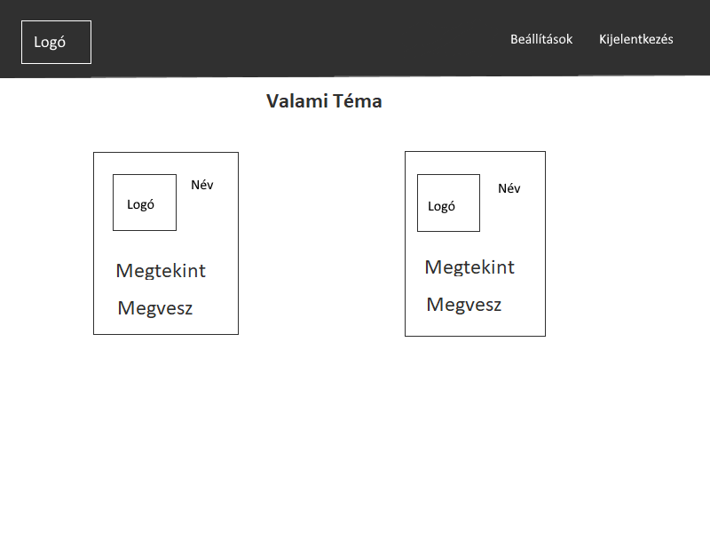
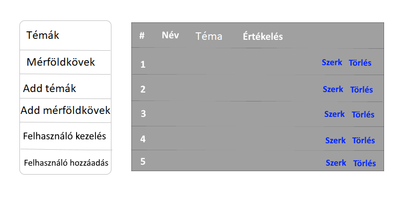

## 1.Áttekintés

A rendszer a matematikai tanulmányok megsegítésére szolgáló alkalmazást kíván megvalósítani a jövendőbeli felhasználók számára. A rendszer lényege az, hogy a felhasználók különböző kurzusokat, képzéseket hozhatnak létre megadott témakörökkel, tananyagokkal. Felhasználó rendszer megvalósítása szükséges annak érdekében, hogy csak regisztrált felhasználó tudjon létrehozni kurzust vagy jelentkezni egyre. Ez azért szükséges hogy az egyes kurzoskat asszociálni tudjuk a felhasználókhoz, tárolni tudjuk az előrehaladásukat, sikereiket stb. Ezen adatokat egy adatbázisban kell eltárolni az adatok későbbi feldolgozása érdekében. Sikeres regisztráció és bejelentkezés után tudnak létrehozni kurzoskat és tudnak jelentkezni azokra a felhasználók. A regisztrált felhasználók megtekinthetik fiókjuk adatait és módosíthatják azokat. A felhasználók résztvehetnek, teljesíthetik a kurzusokat valamint lehetőséget kell biztosítani a véleménykifejtésre és egy fajta fórumot kell megvalósítani ahol a kérdéseiket feltehetik a kurzus résztvevői a tananyaggal kapcsolatban. Azok akik nem rendelkeznek fiókkal, látogatóknak minősülnek, akik betekintést nyerhetnek az alkalmazás funkcióiba, megtekinthetik az elérhető kurzusokat de nem jelentkezhetnek azokra, nem hozhatnak létre kurzosokat. A kurzos létrehozás során, a kurzushoz létrehozhatunk teszteket, tölthetünk fel videókat és különböző anyagokat amelyek segítik az aktuális tananyag megértését. Hasznos lenne lehetőséget biztosítani a korrepetálásra azon kurzus résztvevői számára, akik nem értik az anyagot és segítségre szorulnak. Egyes kurzusoknál mérföldköveket érhetnek el a résztvevők és előrehaladásukat nyomon tudják követni. Így megtudják, hogy mit hagytak ki, mit nem teljesítettek még vagy éppen azt, hogy melyik fejezeteket fejezték már be, teljesítették sikeresen. Lehetőséget kell biztosítani komplexebb és egyszerűbb kurzusok létrehozására egyaránt. A kurzusok létrehozását, megvalósítását objektum orientált módon kell megvalósítani az újrafelhasználhatóság érdekében. Így követhető egy alap séma minden kurzus létrehozásánál. A felmerülő hibák kiküszöbölésének érdekében szükséges egy felsőbb rendű felhasználó aki tudja módosítani a kurzusokat, törölni azokat, szerkesztheti a többi felhasználó adatait. Ezen felsőbb rendű felhasználó számára tudják jelezni az alkalmazásban felmerülő hibákat a felhasználók és ő tudja orvosolni vagy tudja jelezni a programmozó csapat felé a hibát. Ezt leszámítva minden felhasználó csak a saját kurzusát módosíthatja, törölheti más felhasználóét nem.

## 2. Jelenlegi helyzet

A jelenlegi kellemetlen helyzetben sok középiskolás tanuló, egyetemi hallgató szorul az internet segítségére tanulmányaik sikeres elsajátításának érdekében. Ezt a tanárok és oktatók is egyre inkább ajánlják, szorgalmazzák a tanulók, hallgatók felé. A mostani online oktatás megsegítésének érdekében tervezzük létrehozni ezt az alkalmazást. Itt lehetőségük van a diákoknak együtt tanulniuk az esetleges problémákat együtt értelmezniük megoldaniuk. Itt segítséget kapnak azon diákok, akik egyes részeket nem értenek. Természetesen nem csak tanulók számára szól a rendszer hanem bárkinek aki tudásra szomjazik. Az interneten fellelhetőek ezen célból megvalósított weboldalak, alkalmazások, de ezek általában fizetősek, havi díj fizetése esetén elérhetőek. A legfontosabb számunkra, hogy ezt teljesen ingyenes kínáljuk mindenki számára, hiszen nem célünk a tudást pénz mögé rejteni. Ezen felületen mindenki megoszthatja a többiekkel tudását. Így ha mindenki megosztja a tudását azon területről amiben ő erős, elérhetjük azt, hogy mindenki egységesen felzárkózik az iskolában elvárt szintre, tanulhatnak egymástól a diákok az alapján, hogy ki miben erős. Lehetőségük lesz a tanároknak is tananyagaikat ide feltölteni a tanulók számára, feladatok megosztására. Jelenleg a többi rendszer mondhatni elavult, bonyolult ezért szükséges egy egyszerűbb, modernebb környezet kialakítása. Mindezek összességével elérhetjük, hogy tanulók, hallgatók jobb eredményeket érjenek el, sikeres vizsgákat tegyenek tanulmányaik során ebben a nehéz helyzetben.

## 3. Követelménylista

1. Bejelentkezési felület
    - A felhasználók ezen a felületen jelentkeznek be a weboldalra a bővebb elérés érdekében
    - Bejelentkezés után elérhetővé válnak a weboldal funkciói
2. Regisztrációs felület
    - A felhasználók itt tudnak beregisztrálni a weboldalra
    - Regisztráció nélkül nem elérhetőek a weboldal funkciói
3. Kurzusok menüpont
    - A felhasználók itt tudnak jelentkezni, létrehozni kurzusokat
    - A felhasználók itt ismerhetik meg egy adott kurzus témáját
    - Itt módosíthatok a kurzusok, itt törölhetők azok (adminisztrátor, kurzus tulajodonos)
    - Itt követhető nyomon egy adott felhasználó előrehaladása
    - A felhasználók itt érik el a mérföldköveiket
4. Beállítások menüpont
    - Itt módosíthatják a felhasználók a felhasználó nevüket, jelszavukat és e-mail címüket
5. Adatlap menüpont
    - Itt jelenik meg a teljesített, függőben lévő kurzusok listája valamint az éppen aktív kurzusoké
6. Admin panel
    - Felhasználók valamint kurzusok módosítása, törlése az adminisztrátor számára
    
## 4. Jelenlegi üzleti folyamatok modellje

Jelenleg a projektünkhöz hasonló kurzus megosztó oldalakon nem tudsz saját kurzust létrehozni, ezért szeretnénk ezt megvalósítani. A másik hátránya a meglévő oldalaknak az, hogy előfizetés nélkül korlátozott a hozzáférés.

1. Bejelentkezés
    - 1.1 Előfizetés
        - Kurzusok felvétele
        - Kurzusok megtekintése
        - Kurzusok értékelése
    - 1.2 Beállítások
        - Email módosítás
        - Jelszó módosítás
    - 1.3 Kurzus betekintő
    - 1.4 Kijelentkezés
2. Regisztráció

## 5. Igényelt üzleti folyamatok modellje

1. Bejelentkezés
2. Regisztráció
3. Kurzusok (Vendég felhasználók láthatják a már meglévő kurzusokat)
    1. Kurzus kiválasztása
    2. Kurzus szerkesztése
    3. Kurzus törlése
    4. Mérföldkövek
4. Admin jogosultsággal (Ha be van jelentkezve a felhasználó és admin is egyben)
	1. Kurzus létrehozása
	2. Kurzus szerkesztése
	3. Kurzus törlése
	4. Felhasználók kezelése
5. Adatlap (Ha be van jelentkezve a felhasználó)
   1. Teljesített kurzusok
   2. Függőben lévő kurzusok
   3. Kívánságlistán lévő kurzusok
6. Beállítások (Ha be van jelentkezve a felhasználó)

## 6. Használati esetek

- Vendég:
    - Megtekintheti a kurzusokat, de nem hozhatnak létre újat, és nem jelentkezhetnek azokra.
- Felhasználó
    - Megtekintheti a kurzusokat és jelentkezhet azokra. Mérföldköveket érhet el a kurzusban való haladással, és ezeket meg is tekintheti.
    - Létrehozhat saját kurzusokat és ahhoz tartozó mérföldköveket is.
    - Lehetősége van gyakorolni a kurzusokhoz hozzáadott feladatok segítségével.
- Adminisztrátor
    - Képes felhasználókat kezelni, módosítani, törölni.
    - Szerkesztheti, törölheti a kurzusokat.
    - Gondoskodni tud az egyes hibák kijavításáról.
    - Abban az esetben ha nem tudja megoldani akkor tud szólni a programozóknak akik tudják javítani a hibát.

## 7. Képernyő tervek

Főoldalterv:

Bejelentkezés terv:

Regisztráció terv:

Étterem kiválasztása adott városban terv:

Admin panel terv:

## 8. Forgatókönyv

Futási időben sok szereplő figyelhető meg. Egy szereplő létrehozza a kvízt, a többi pedig csatlakozhat a kvízhez ez megfelelő kvízazonosító megadása után majd elkezdhetik a kvíz kitöltését. A kvíz résztvevői a teljesítményük alapján pontot kapnak, az idő és a jó válaszok függvényében. A kvíz végén megjelenik a toplista az összes felhasználóval és pontszámával együtt, ahol össze lehet hasonlítani a felhasználók teljesítményét és le is lehet menteni a listát egy táblázat formájában.  
A felhasználók mérföldköveket tudnak elérni a kvízek kitöltésével, melyet a saját profil fölün nyomon tudnak követni. Mindez szemlélteti egyes felhasználók aktivitását és teljesítményét is.

## 9. Fogalomszótár

- **UML** - Unified Modeling Language
- **Releváns** - fontos, lényeges, meghatározó, jelentős
- **Corrective Maintenance:** A felhasználók által felfedezett és "user reportban"
elküldött hibák kijavítása.
- **Adaptive Maintenance:** A program naprakészen tartása és finomhangolása.
- **Perfective Maintenance:** A szoftver hosszútávú használata érdekében végzett
módosítások, új funkciók, a szoftver teljesítményének és működési
megbízhatóságának javítása.
- **Preventive Maintenance:** Olyan problémák elhárítása, amelyek még nem
tűnnek fontosnak, de később komoly problémákat okozhatnak.