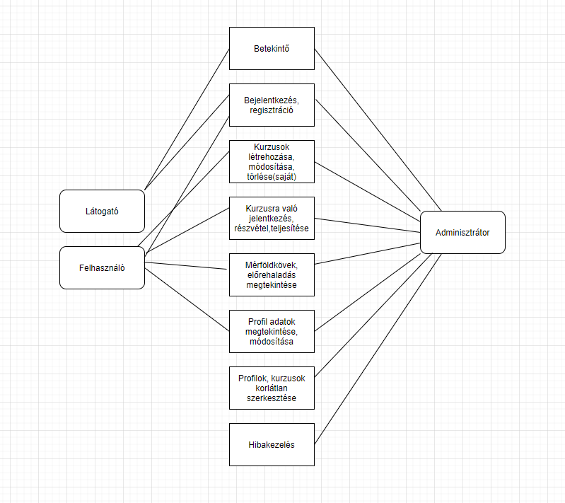

## 1. Rendszer célja

A rendszer egy matematikai tanulmányokat megsegítő weblap. A legfőbb funkció a kurzusok megvalósítása, amelyekre az emberek jelentkezhetnek, létrehozhatnak hogy elkezdjék tanulmányaikat egy adott témakörból. Regisztráció és bejelentkezés nélkül a weboldal funkciói nem elérhetőek. Ebben az esetben egy betekintő oldalra érkezik a látogató és megtekintheti milyen funkciókat érhet el ha készít egy fiókot. Sikeres regisztráció és bejelentkezés után már létrehozhat kurzust a felhasználó és jelentkezhet is azokra. Minden kurzust amelyet létrehoz egy felhasználó adatbázisban kell eltárolni és hozzákell rendelni azt a felhasználóhoz aki létrehozta. Ezek alapján azt is tárolni kell, hogy ki milyen kurzusokra jelentkezett. Ezek alapján megvalósítható az előrehaladás nyomon követése adott felhasználóknál. Az egyes kurzusokhoz biztosítanunk kell a lehetőséget a véleménykifejtésre valamint a kérdések feltevésére. Ezt egy fórum szerű felületen tehetik meg a felhasználók, ezzel növelhetjük az interakciót a kurzus vezető és a kurzus résztvevő között. A felhasználók mérföldköveket teljesíthetnek előrehaladásuk során. Lehetőséget kell biztosítanunk egyaránt egyszerű és komplexebb kurzusok megvalósítására. Ezt elérhetjük előre létrehozott sémák segítségével. A kurzusokba videó anyagokat, hang anyagokat is fel lehet tölteni így ezt is engedélyeznünk kell. Az adott kurzusokat módosíthatják, törölhetik a felhasználók de csak az aki az adott kurzusnak a tulajdonosa, más felhasználó nem. Ezen kívül szerkeszthetik profiljuk adatait is. Ezen felületen tekinthetik meg kurzusokkal kapcsolatos információjukat is a felhasználók. Létre kell hoznunk egy olyan jogkört, egy felsőbb rendű felhasználót aki a weboldalon történő karbantartást végzi. Ezen felhasználó nevezzük adminisztrátornak korlátlanul módosíthatja, törölheti a kurzusokat valamint szerkesztheti a felhasználók adatait. Ő kapja meg a felhasználók által jelzet hibákat is amelyeket orvosolhat vagy tovább küldheti a fejlesztő csapatnak. Ezen funkciós összességével megvalósíthatunk egy e-learning felület ahol a felhasználók kiaknázhatják tudásukat tanulmányaik teljesítésének érdekében.

## 2. Projektterv

1. Projektszerepkörök:
  - Termék tulajdonos: Devtrio (teljes csapat)
2. Projektmunkások és felelősségek:
  - Backend munkálatok: Csapat tagjai
  - Frontend munkálatok: Csapat tagjai Feladatuk: adatbázis létrehozása az adatok tárolásához, megfelelő funkciók elkészítése az oldal megfelelő működésének érdekében, felhasználói felület kialakítása.
3. Ütemterv
4. Követelmény specifikáció
5. Funkcionális specifikáció
6. Rendszerterv
7. Adatbázis kialakítása
8. Backend funkciók elkészítése
9. Frontend design megtervezése
10. Felhasználói felület kialakítása
11. Tesztelés
  - Unit teszt
  - Modul teszt
  - Integtrációs teszt
12. Átadás

## 3. Üzleti folyamatok modellje



## 4. Követelmények

**Funkcionális követelmények**
  - Bejelentkezés
  - Regisztráció
  - Kijelentkezés
  - Felhasználók adatainak tárolása
  - Felhasználók tudják változtatni adataikat
  - Lehetőség van kurzusok felvételére
  - Saját kurzusok létrehozására is van lehetőség
  - A kurzusokban való haladással mérföldkövek elérése
  - Elért mérföldkövek megtekintése
  - Hiba esetén lehetőség van értesíteni az adminisztrátort
  - A kurzusokban létrehozott gyakorló feladatok kitöltése is lehetséges, és kitöltés után visszajelzést kap a felhasználó a teljesítményéről

  **Nem funkcionális követelmények**
  - A felhasználók nem férnek hozzá egymás adataihoz
  - A felhasználók nem tudják módosítani a más által közzétett kurzust
  - Az adminisztrátori felületet csak az adott joggal rendelkezők érik el
  - A felhasználók nem tudnak más nevében felvenni kurzusokat
  - A vendégek nem tudnak felvenni kurzusokat
  - Vendégek nem tudnak létrehozni kurzust
  - Bejelentkezett felhasználóknak a bejelentkezés és a regisztráció fül nem elérhető.

  **Törvényi előírások, szabványok:**
  - GDPR-nak való megfelelés
  - Tervezési mintáknak való megfelelés.

  ## 5. Funkcionális terv

  **Rendszerszereplők:**
  - Adminisztrátor
  - Felhasználó
  - Vendég

  **Rendszerhasználati esetek és lefutásaik:**
  - **Adminisztrátor**
    - Felhasználók adatainak módosítása, felhasználók törlése
    - Kurzusok hozzáadása, kurzusok módosítása
    - Hibák javítása, adott esetben hiba jelzése a programozóknak.
  - **Felhasználó**
    - Kurzus felvétel
    - Kurzus leadás
    - Kurzus felvétele a kívánságlistára
    - Saját kurzus létrehozása
    - Saját kurzusok szerkesztése

  - **Vendég**
    - Kurzusok megtekintése
    - Regisztráció
    - Bejelentkezés

  - **Menü-hierarchiák:**

## 6. Fizikai környezet
  - Az alkalmazás csak web platformra készül.
  - Nincsenek megvásárolt komponensek.
  - **Fejlesztői eszközök:**
    - Visual Studio Code
    - Notepad++
    - Sublime text 3
    - MongoDB
    - HediSQL 

## 7. Architekturális terv
 A rendszer mögött van egy adatbázis, ebben az esetben egy MongoDB. A weblaphoz React frameworkot használunk és emellett Node JS-t is. A megjelenítésért a Bootstrap felel.

## 8. Adatbázis terv

**DSL**
```
CREATE TABLE `lecture` (
	`lid` INT NOT NULL AUTO_INCREMENT,
	`Name` varchar(100) NOT NULL AUTO_INCREMENT,
	PRIMARY KEY (`cid`)
);

CREATE TABLE `topic` (
	`tid` INT NOT NULL AUTO_INCREMENT,
	`tname` varchar(200) NOT NULL AUTO_INCREMENT,
	`tprice` INT(11) NOT NULL,
	`userid` INT(11) NOT NULL,
	PRIMARY KEY (`fid`)
);

CREATE TABLE `users` (
	`id` INT NOT NULL AUTO_INCREMENT,
	`username` varchar(200) NOT NULL UNIQUE,
	`email` varchar(200) NOT NULL,
	`password` varchar(200) NOT NULL,
	`flags` INT(11) NOT NULL,
	PRIMARY KEY (`id`)
);

CREATE TABLE `milestone` (
	`id` INT NOT NULL AUTO_INCREMENT,
	`name` varchar(200) NOT NULL,
	`earned` INT(11) NOT NULL,
	`achivement_point` INT(11) NOT NULL,
	`description` INT(11) NOT NULL,
	`lecId` INT(11) NOT NULL,
	PRIMARY KEY (`id`)
);

ALTER TABLE `topic` ADD CONSTRAINT `topic_fk0` FOREIGN KEY (`userid`) REFERENCES `milestone`(`id`);

ALTER TABLE `milestone` ADD CONSTRAINT `milestone_fk0` FOREIGN KEY (`lecId`) REFERENCES `lecture`(`lid`);


```


 ## 9. Implementációs terv

A webes felület HTML, CSS és PHP nyelven fog készülni. A különböző technológiákat amennyire lehet, külön fájlokba írva készítjük el, úgy csatoljuk egymáshoz. Így átláthatóbb, könnyebben változtatható és bővíthető lesz. A felhasználók, városok, éttermek és rendelések adatait egy MongoDB adatbázisban fogjuk tárolni. A reszponzív webdesign-t Bootstrap-pel fogjuk biztosítani.

 ## 10. Tesztterv

Az alább leírt tesztelések célja a rendszer és funkcióinak teljes körű vizsgálata, ellenőrzése a megfelelő működés érdekében.

Linkek, gombok tesztelése: a teszt célja a weboldalon megjelenő linkek és gombok megfelelő működésének ellenőrzése.
A weboldal és az adatbázis kapcsolatának vizsgálata: fel kell tudnia tölteni az adatbázist a megfelelő adatokkal és vissza kell tudnia adni azokat. Törlési, hozzáadási, módosítási műveletek tesztelése. A jelszavak megfelelő tárolásának ellenőrzése, vagyis minden jelszó titkosításának (hashelésének) ellenőrzése.
Hibás, hiányos adatok esetén adott hibaüzenetek ellenőrzése.
Kiléptető rendszer tesztelése, egy nap után ki kell jelentkeztetnie a felhasználót.
Számla nyomtatás működésének ellenőrzése.
Étterem értékelés működésének vizsgálata.
A weboldal helyes működésének ellenőrzése különböző böngészőkben pl. Firefox, Google Chrome…

## 11. Telepítési terv

1. Apache telepítése
2. MongoDB server telepítése
3. Forráskód importálása
4. SQL importálása

1. Webserver bérlése
2. Forráskód Importálása
3. Adatbázis importálása

## 12. Karbantartási terv
A felhasználók egy report formájában tudják jelenteni a felmerűlő funkcionális hibákat és az adminok tudják javítani.
A javított hibák egy oldalon Changelog vagy hír formában meg fognak jelenni visszajelzésként a felhasználók felé, az új funkciók / frissítésekkel együtt.